# notes

This is a repository to cross-post texts across Twitter and Mastodon. If you create an issue and give `publish` label to it, GitHub Workflows automatically cross-posts it.

## Setup

1. Fork this repository

<details>
<summary>
2. Get Twitter tokens
</summary>

1. Go to https://developer.twitter.com/portal/dashboard

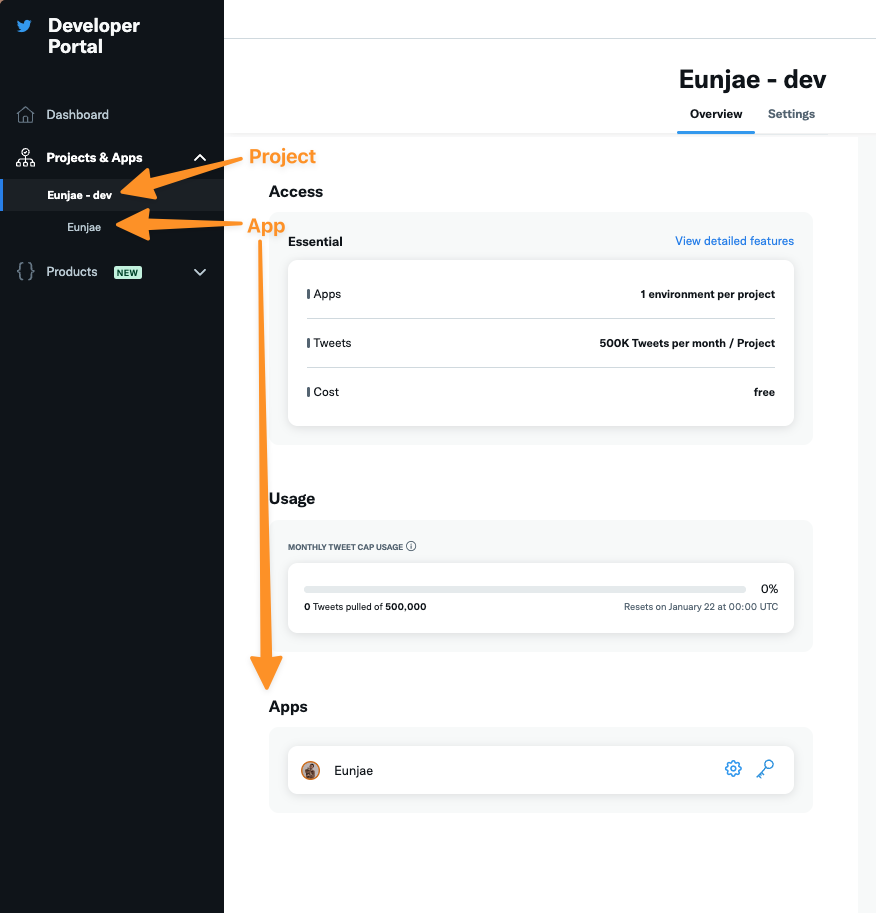

2. Click the app to see the tokens

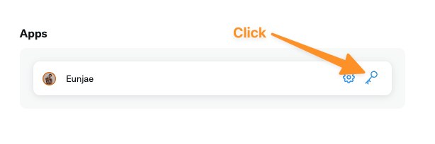

3. Grab them all

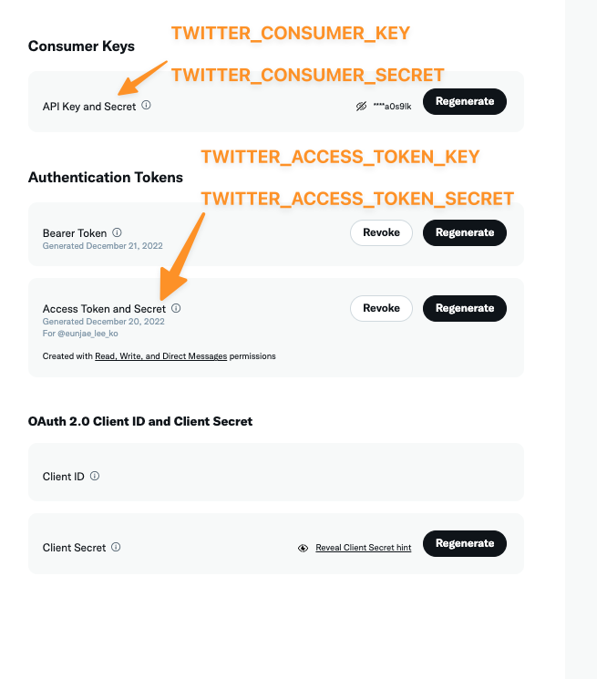

You need

- `TWITTER_CONSUMER_KEY`
- `TWITTER_CONSUMER_SECRET`
- `TWITTER_ACCESS_TOKEN_KEY`
- `TWITTER_ACCESS_TOKEN_SECRET`

</details>

<details>
<summary>
3. Setup the Twitter tokens in your repository
</summary>

1. Go to your repository and follow this path

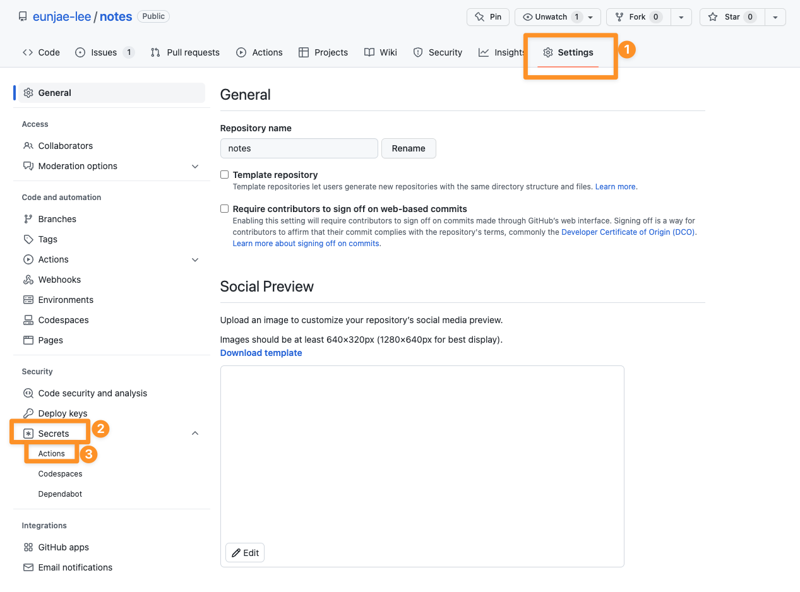

2. Click "New repository secret" button and add the keys above. You need to add secret one-by-one.

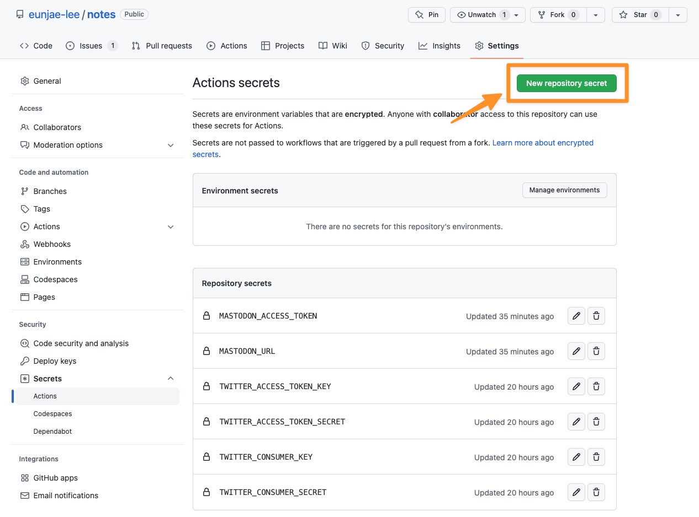

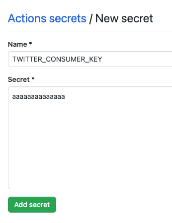

</details>

<details>
<summary>
4. Get Mastodon token
</summary>

1. Go to your Mastodon server and follow this path to create a new application

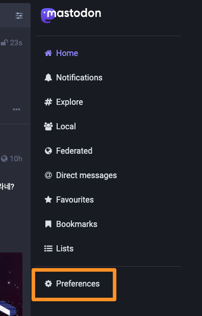

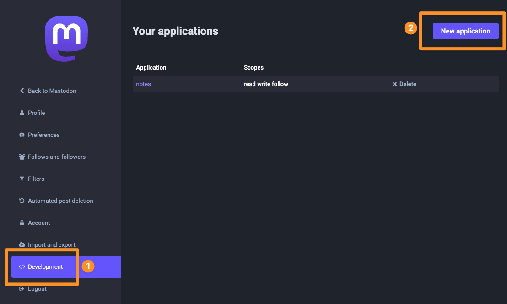

2. Name the application and the rest is optional. (`write` permission is what we need and it's checked by default)

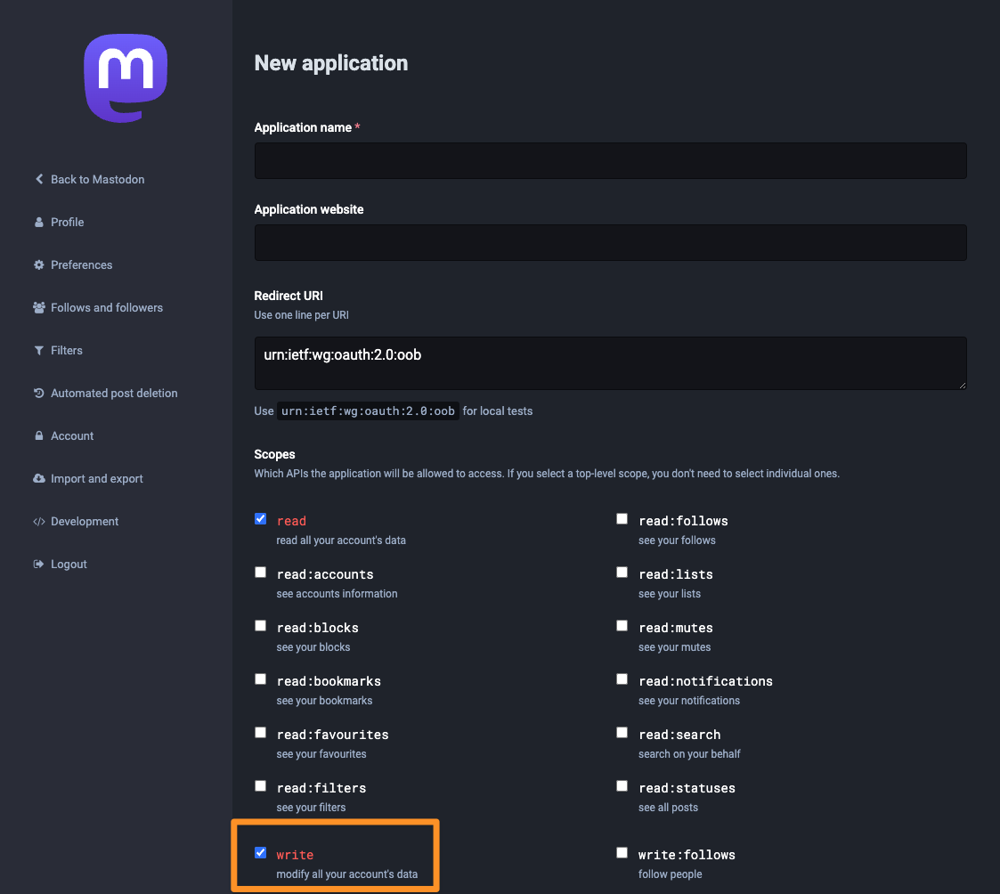

3. After creating it, open the app again, and you'll get the access token.


</details>

<details>
<summary>
5. Setup the Mastodon token in your repository
</summary>

1. Go to your repository and follow this path


2. Click "New repository secret" button and add the access token (name: `MASTODON_ACCESS_TOKEN`)

3. Click "New repository secret" button again, and this time, add your Mastodon server url

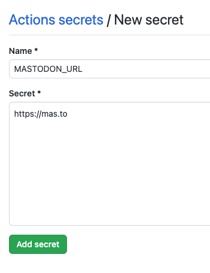

</details>

<details>
<summary>
6. Create an issue to cross-post
</summary>

1. Go to your Issues tab on your repository

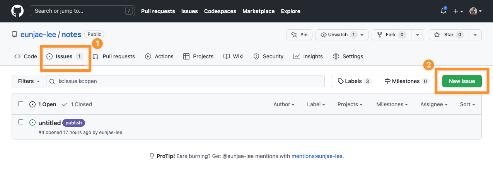

2. Create an issue with a label `publish`. Or, you can create an issue first, and later add a label `publish` when you're ready to publish it.

The title of issue isn't used for Twitter or Mastodon. So you can put anything like `untitled` there.


3. voilà! It's done.

</details>

## Configuration

You can tweak the behavior by modifying `config.ts`.

<details>
<summary>
1. default configuration
</summary>
Its default config is like this:

```typescript
const config: Config = {
  labels: {
    publish: [{ type: "twitter" }, { type: "mastodon" }],
  },
};
```

You can leave it as-is if you're good with the functionality.
</details>

<details>
<summary>2. configuration per label (multi-pipelines) </summary>

The default label that triggers the workflow is `publish`, but you can configure other labels that start with `publish_`.
For example, you have two Twitter accounts, one for English and another one for Korean. And two Mastodon accounts as well.

You can configure `publish_english` and `publish_korean`.

```typescript
const config: Config = {
  labels: {
    publish_english: [
      { type: "twitter", env_var_prefix: "EN_" },
      { type: "mastodon", env_var_prefix: "EN_" },
    ],
    publish_korean: [
      { type: "twitter", env_var_prefix: "KO_" },
      { type: "mastodon", env_var_prefix: "KO_" },
    ],
  },
};
```

You might've noticed `env_var_prefix` above. When you're setting up more than one Twitter or Mastodon account, you need to name those tokens differently. That's what that prefix is for.

Then, in this case, you need to add the following secrets to your GitHub repository:

```
EN_TWITTER_CONSUMER_KEY
EN_TWITTER_CONSUMER_SECRET
EN_TWITTER_ACCESS_TOKEN_KEY
EN_TWITTER_ACCESS_TOKEN_SECRET
KO_TWITTER_CONSUMER_KEY
KO_TWITTER_CONSUMER_SECRET
KO_TWITTER_ACCESS_TOKEN_KEY
KO_TWITTER_ACCESS_TOKEN_SECRET

EN_MASTODON_ACCESS_TOKEN
EN_MASTODON_URL
KO_MASTODON_ACCESS_TOKEN
KO_MASTODON_URL
```

Unfortunately, you're not finished. You need to modify `.github/workflows/publish.yml`.
You need to pass all the secrets above to the process as environment variables. If you're not sure what this means, create an issue in this repository to ask. I'll walk you through the configuration.
</details>

## Update

This repository my get some updates or new feature. If you want it in your forked repository, check out this article: https://docs.github.com/en/pull-requests/collaborating-with-pull-requests/working-with-forks/syncing-a-fork

## Reference

- twitter-api-v2: https://github.com/plhery/node-twitter-api-v2
- twitter-text: https://github.com/twitter/twitter-text
- masto.js: https://github.com/neet/masto.js/
- Structuing and bundling for GitHub workflows: https://github.com/amannn/action-semantic-pull-request
